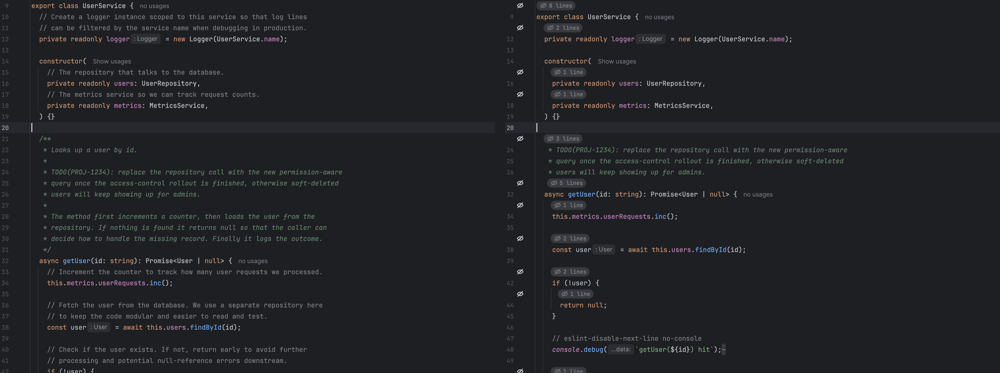
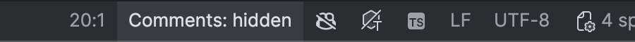

# CommentCloak

**Hide AI noise. Keep what matters.**

**Website:** https://max9599.github.io/comment-cloak/ · **Marketplace:** https://plugins.jetbrains.com/plugin/34096

[](https://plugins.jetbrains.com/plugin/34096) [](https://plugins.jetbrains.com/plugin/34096) [](https://github.com/max9599/comment-cloak/actions/workflows/ci.yml)

[](https://max9599.github.io/comment-cloak/)

An IntelliJ Platform plugin that visually cloaks source-code comments in the editor — without
touching a single byte of your files.

## Screenshots

Real WebStorm 2025.2 editor, same file, one keystroke apart. Left: AI narration everywhere.
Right: CommentCloak on — each hidden block becomes a small pill, the `TODO` paragraph inside the
JSDoc stays visible, and the `eslint-disable` directive is kept.



The status bar shows the current state and toggles on click:



## Why

AI-generated code comes with AI comments. Copilot, Claude, Cursor and friends narrate every step:
`// Increment the counter by one` sitting directly above `counter++`. Any one of them is harmless;
together they double the height of every file and bury the three comments that actually explain
something.

CommentCloak folds that narration away so you can read the code, and brings it back with a single
keystroke.

## What it does — and does not do

CommentCloak collapses comments using the editor's own **fold regions**, exactly like the IDE folds
imports and method bodies.

- Nothing is deleted, nothing is rewritten.
- The file on disk is never modified; version control sees no change.
- Toggle it off and every comment is back exactly where it was.
- **Hover a marker to peek** at the text it stands for. **Click a marker** (or its gutter icon) to
  reveal a comment; it cloaks itself again once your caret leaves it.

## Features

- **One-key toggle** — `Ctrl+Alt+/` hides or shows comments everywhere at once. Remembered across
  IDE restarts.
- **Right-click menu entry** in the editor, plus an entry in the **View** menu.
- **Status bar switch** — `Comments: hidden` / `Comments: shown`; click to flip.
- **Keeps what matters** — `TODO`, `FIXME`, `HACK`, `XXX`, `BUG`, `NOTE` stay visible.
- **Keeps tool directives** — `eslint-disable`, `@ts-ignore`, `@ts-expect-error`, `noinspection`,
  `noqa`, `prettier-ignore`, `biome-ignore`, `istanbul`, `webpack`, `@vite`, `@jsx`, `@flow`,
  `sourceMappingURL`, `@__PURE__`, `region` / `endregion` markers.
- **Keeps license headers** — `Copyright`, `SPDX-License`, `@license`, `@preserve`.
- **Keeps only the paragraph that matters** — a fifteen-line JSDoc block with one
  `TODO(PROJ-1234): …` paragraph keeps the TODO and hides the essay around it, instead of leaving
  the whole block on screen.
- **Compact pill marker** — a hidden block collapses to a small rounded badge with the CommentCloak
  icon and the line count, drawn on the comment's own lines so nothing above it shifts. Switch to
  the classic fold placeholder in the settings if you prefer.
- **Documentation comments too** — AI assistants love essay-length JSDoc blocks, so `/** … */` is
  cloaked by default; one checkbox keeps JSDoc / KDoc / docstrings visible if you prefer.
- **Per-kind filters** — line (`//`, `#`, `--`), block (`/* … */`), documentation (`/** … */`) and
  HTML (`<!-- … -->`) comments can each be cloaked or kept independently.
- **Minimum length filter** — keep the one-liners, hide only the essay-style explanations.
- **Regex keep-list** — add your own patterns; anything matching is never hidden.
- **Whole-line collapsing** — consecutive comment lines merge into a single small placeholder and
  take their line breaks and indentation with them, so no blank gaps are left behind.
- **Caret aware** — the comment you are editing is never folded out from under your cursor. Click a
  marker to reveal a comment; it cloaks itself again once your caret leaves it, so nothing you open
  stays open by accident.
- **Survives the IDE's own folding passes** — the regions are restored if a folding pass drops them.
- **Works everywhere** — IntelliJ IDEA, WebStorm, PyCharm, GoLand, Rider, PhpStorm, RubyMine, CLion,
  DataGrip and Android Studio, in any language whose parser produces comment tokens.

## Usage

| Action | Where |
| --- | --- |
| Toggle | `Ctrl+Alt+/` (all platforms) |
| Toggle | Editor right-click menu → **Hide Comments** / **Show Comments** |
| Toggle | **View \| Hide Comments** |
| Toggle | The `Comments: …` status bar widget (click it) |
| Settings | **Settings/Preferences \| Editor \| CommentCloak** |
| Settings | **View \| CommentCloak Settings…** |

## Settings

**Settings/Preferences | Editor | CommentCloak**

| Setting | Default | What it does |
| --- | --- | --- |
| Line comments | on | Cloak `//`, `#`, `--` style comments |
| Block comments | on | Cloak `/* … */` comments |
| Documentation comments | on | Cloak `/** … */` / docstring comments |
| HTML/XML comments | on | Cloak `<!-- … -->` comments |
| Hidden-comment marker | Compact pill | Pill badge with the line count, or the plain fold placeholder |
| Collapse whole comment lines | on | Plain marker only: also swallow the line break and indentation |
| Only hide comments with at least N characters | 0 | 0 means no minimum |
| Placeholder | `⋯` | Text shown in place of a cloaked comment |
| Always keep comments matching | see above | One regular expression per line |
| Show only the matching paragraph | on | Hide the rest of a block that contains a keep match |

Invalid regular expressions are reported when you press **Apply**.

## Install

**From the Marketplace (recommended):** in your IDE open **Settings → Plugins → Marketplace**, search for
*CommentCloak* and click **Install** — or open the [Marketplace page](https://plugins.jetbrains.com/plugin/34096).

### From disk

1. Build the zip (below) or download `comment-cloak-0.1.0.zip`.
2. In the IDE, open **Settings/Preferences | Plugins**.
3. Click the gear icon (⚙) → **Install Plugin from Disk…**.
4. Pick the zip and restart the IDE when prompted.

Requires build 252 (2025.2) or newer. There is no upper bound, so the plugin keeps working with
future releases.

## Building

The plugin builds against a locally installed IDE, so no IDE distribution is downloaded. Any JDK 21
works — including the JetBrains Runtime bundled with your IDE, which is handy when there is no
system JDK:

```bash
export JAVA_HOME=/Applications/WebStorm.app/Contents/jbr/Contents/Home
./gradlew buildPlugin
```

The installable archive lands in `build/distributions/comment-cloak-0.1.0.zip`.

```bash
JAVA_HOME=... ./gradlew test                             # run the unit tests
JAVA_HOME=... ./gradlew verifyPluginProjectConfiguration # sanity-check the plugin descriptor
JAVA_HOME=... ./gradlew runIde                           # launch a sandbox IDE with the plugin
```

The target IDE is configured in `build.gradle.kts` as
`intellijPlatform { local("/Applications/WebStorm.app") }` — point it at any other 2025.2+ IDE
installation to build against that instead.

## Roadmap

- **Smart filtering of AI narration** — detect and hide only the comments that merely restate the
  line that follows them, keeping genuinely explanatory ones.
- **Dim-instead-of-hide mode** — fade comments to a low-contrast colour rather than folding them.
- **Per-project settings** — different rules for different codebases.
- **File and language exclusions** — never cloak comments in, say, migrations or `.d.ts` files.

## License

[Apache 2.0](LICENSE) © 2026 Maxim Gromov
